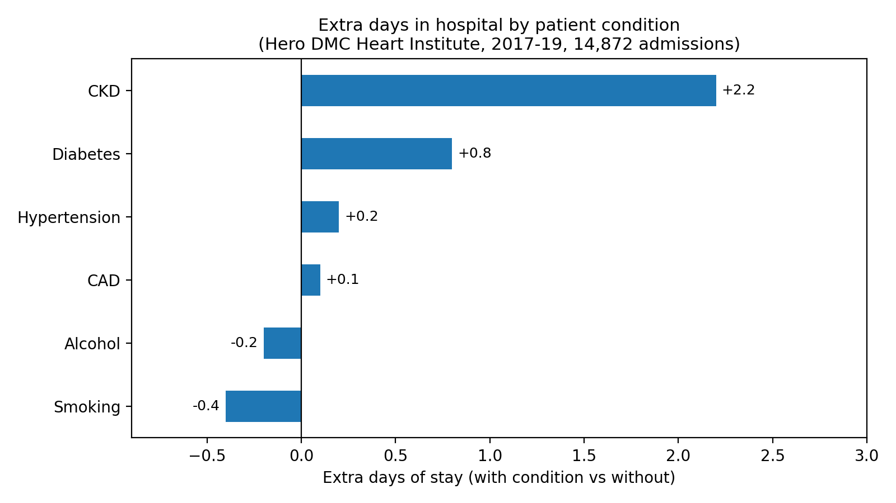

# Cardiology Admissions Analysis: Hero DMC Heart Institute (2017-19)

Exploratory analysis of 14,872 cardiology admissions from a tertiary care hospital in Ludhiana, India, using Python (pandas, matplotlib) in Google Colab.

**Data:** [Hospital Admissions Data on Kaggle](https://www.kaggle.com/datasets/ashishsahani/hospital-admissions-data) (CC BY-NC-SA 4.0). The data is not included in this repository.

## Key findings

1. 73.4% of admissions were patients aged 45 to 74.
2. Emergency admissions stayed 7.0 days on average, versus 5.1 days for OPD admissions.
3. Patients with chronic kidney disease (CKD) stayed about 2 days longer (8.3 vs 6.2 days), in both emergency and OPD admissions.
4. Among emergency admissions, in-hospital deaths were 18.0% with CKD versus 9.4% without.
5. Diabetic patients stayed about 0.8 days longer, but had a lower share of in-hospital deaths (8.2% vs 11.6% in emergency admissions). The reason is unclear from this data.

## What I did

- Cleaned mixed date formats (day/month and month/day) by checking each row against the recorded length of stay.
- Removed 885 exact duplicate rows; kept 63 rows with unreadable dates (dates left blank).
- Analysed age groups, admission type, health conditions, length of stay and in-hospital outcomes.
- Added sanity checks that confirm the key numbers.

## Files

- `hdhi_admissions_analysis.ipynb`: the full analysis
- `charts/`: charts produced by the notebook

## How to run

1. Download the dataset from the Kaggle link above.
2. Open the notebook in Google Colab and upload the CSV.
3. Run all cells.

## Limitations

- One hospital's cardiology unit (2017-19); results do not generalise to other hospitals.
- Counts are admissions, not patients; some patients were admitted more than once.
- These are patterns in the data, not causes. Age and other conditions are not adjusted for.
- This is a learning project, not a clinical tool.
